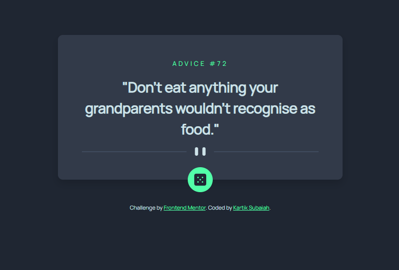

# Frontend Mentor - Advice generator app solution

This is a solution to the [Advice generator app challenge on Frontend Mentor](https://www.frontendmentor.io/challenges/advice-generator-app-QdUG-13db). Frontend Mentor challenges help you improve your coding skills by building realistic projects.

## Table of contents

- [The challenge](#the-challenge)
- [Screenshot](#screenshot)
- [Links](#links)
- [Built with](#built-with)
- [Continued development](#continued-development)
- [Author](#author)
- [Acknowledgments](#acknowledgments)

### The challenge

Random advice generating app by clicking the dice icon using the [Advice Slip API](https://api.adviceslip.com).

### Screenshot

### Links

- Solution URL: (https://github.com/kartiksubaiah/Advice-generator-app_Frontendmentor.io)
- Live Site URL: (https://kartiksubaiah.github.io/Advice-generator-app_Frontendmentor.io/)

### Built with

- Semantic HTML5 markup
- CSS custom properties
- Flexbox
- CSS Grid
- Bootstrap
- Javascript

### Continued development

-I used Bootstrap thinking it would be way easier than vanilla, however I faced the challenge of trying to change the column width class for mobile phone view using media query.
But anyways it was achieved by changing the width prperty in the media query.
-I also faced the challenge of having the dice icon moving along the bottom edge of the container as the container changed the size as per the quote length. It was achieved using the position: Relative property for the container. The position property is something which I have to spend a little more time on to understand.

## Author

- Name- [P G Kartik Subaiah]
- Frontend Mentor - [@kartiksubaiah](https://www.frontendmentor.io/profile/kartiksubaiah)

## Acknowledgments

Thanks to "Code with Ali"(youtube) for some tips.
